# 我的五恒住宅

## 让住宅，拥有自己的气候

门窗关闭以后，住宅依然温和、干爽、新鲜、洁净、安静。

> 五恒不是五台设备，而是一套可以被身体感知、也可以被数据验证的住宅室内气候。

**恒温 · 恒湿 · 恒氧 · 恒洁 · 恒静**

---

# 五恒的起点：湖南住宅面对的复合环境

冷暖只是表层。高含湿量、露点拖尾、冬季湿冷、关窗后的空气更新与噪声矛盾，才是住宅室内气候难以长期稳定的原因。

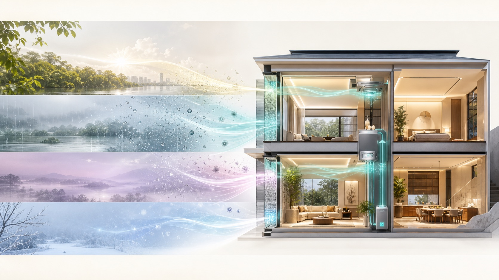

## 梅雨与返潮

室外含湿量持续偏高，开窗并不能解决潮湿，反而可能把湿负荷带入室内。

## 高温高湿

温度降下来了，汗液蒸发和体感仍可能不轻盈。低温不等于干爽。

## 冬季湿冷

空气、墙面与窗边表面温度共同影响体感，地面温暖并不自动等于全身舒适。

## 关窗矛盾

住宅越追求安静、密闭与高品质装修，越需要持续、有组织的空气更新。

---

# 传统设备为什么难以形成完整结果

空调处理显热，地暖改善冬季脚感，普通新风完成换气；但湿度、露点、压差、过滤、噪声与分空间控制经常被分散处理。

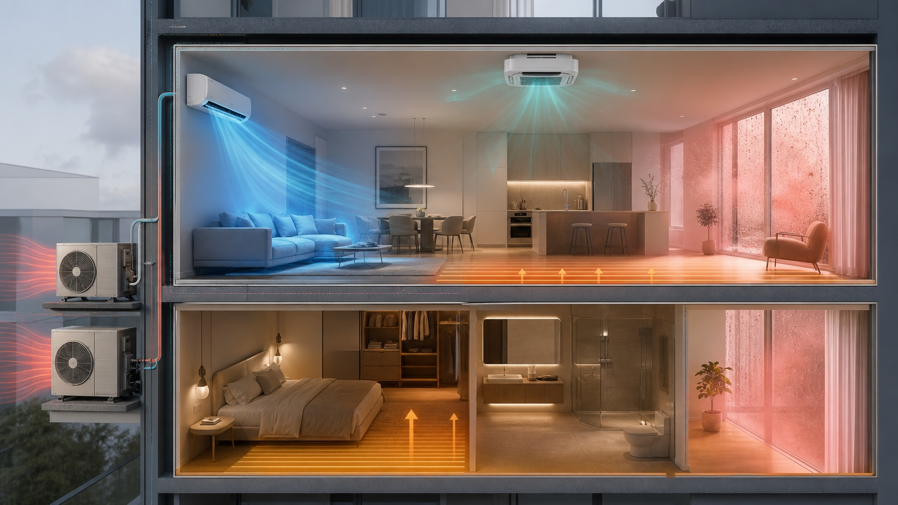

设备分别有效，并不代表结果能够自然汇聚。

五恒住宅真正需要的是一套围绕室内气候目标协同运行的系统，而不是继续叠加彼此不理解的设备。

---

# 五项可以验收的环境结果

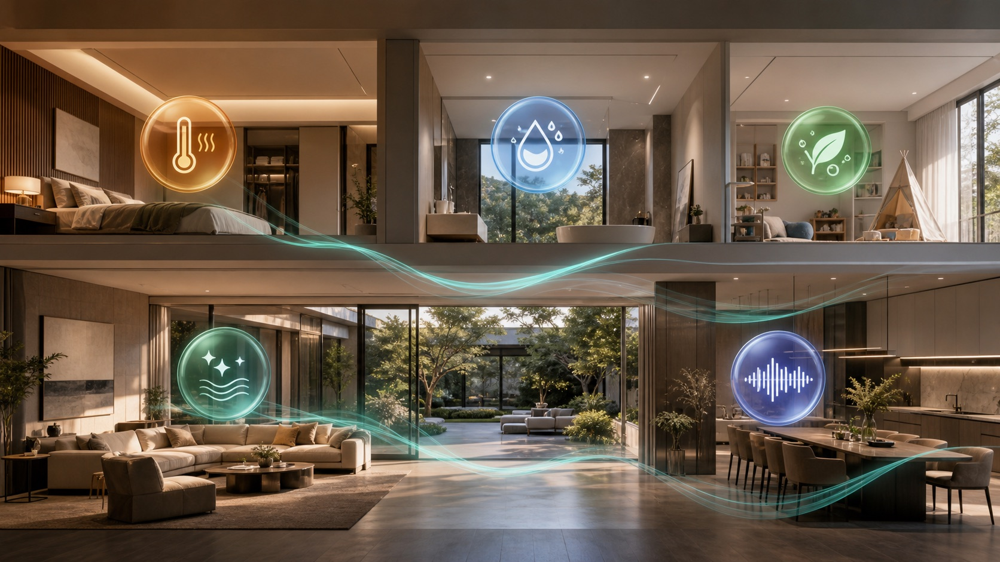

## 恒温

空气温度与表面温度连续稳定，减少冷热波动、局部冷感与强风感。

**验证维度：** 室温、垂直温差、表面温度

## 恒湿

主动处理潜热和含湿量，让露点远离冷表面与围护结构风险区。

**验证维度：** 相对湿度、含湿量、室内露点

## 恒氧

持续有组织地更新空气，以新风量和 CO₂ 趋势判断通风是否真正有效。

**验证维度：** 设计新风量、CO₂ 趋势

## 恒洁

通过过滤、压力组织和排风协同，持续控制颗粒物、异味与污染迁移。

**验证维度：** PM2.5、过滤等级、房间压差

## 恒静

系统低存在感运行，不以明显噪声和送风扰动交换其他四项结果。

**验证维度：** 背景噪声、末端声级、风速

> 以上是设计与验收的指标框架。具体目标应结合建筑围护结构、人员密度、房间用途、室外气候和末端路线进行校核。

---

# 五恒住宅带来的生活价值

技术路线不应只停留在设备图纸里。它最终要转化成可以被身体感知、被家庭长期使用的日常体验。

| 生活价值 | 居住感受 |
| --- | --- |
| 四季温和 | 冷热连续而柔和，减少房间之间和垂直方向的明显温差 |
| 湿度舒爽 | 温度与湿度分别处理，不用过度降温掩盖空气中的水汽 |
| 少直吹感 | 让人体主要停留区域远离高速冷风和局部热风扰动 |
| 洁净新鲜 | 持续过滤、补充与组织新风，把污染物和异味有序带走 |
| 安静睡眠 | 将设备、风口与管路噪声作为设计目标，而不是入住后的补救 |
| 空间简洁 | 设备与末端服从室内设计，让环境系统保持低存在感 |
| 智能感知 | 温湿度、CO₂ 和空气状态持续可见，控制不再只靠主观感受 |
| 长期可管 | 运行策略、维护计划和远程服务共同决定系统能否长久稳定 |

---

# 不靠一阵强风，也能让身体感到温和

传统空调主要依靠空气高速循环完成换热，人体容易感知出风温度、风速和局部温差。

五恒住宅强调空气温度、表面温度、湿度与末端共同协同，让冷热不必以强烈风感出现：

- 夏季不以过低温度换干爽
- 冬季同时关注空气与表面温度
- 卧室夜间降低风感和系统存在感

---

# 会呼吸的家

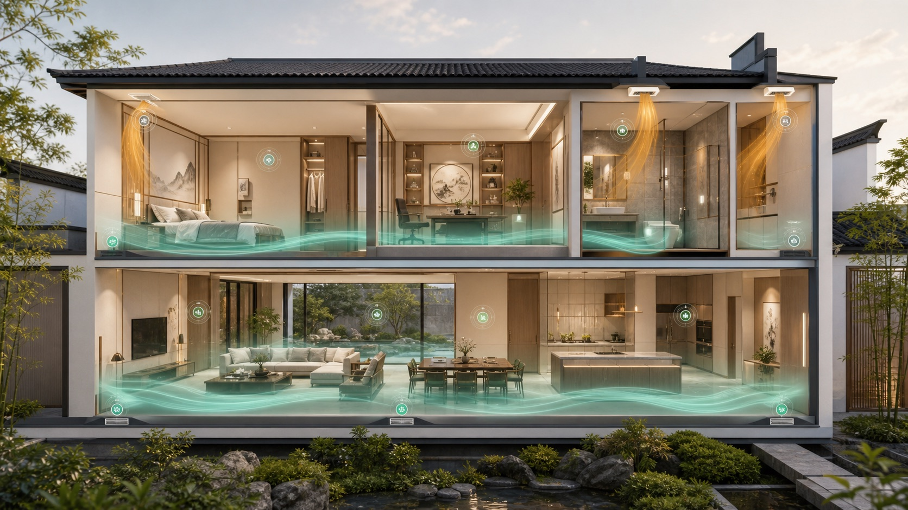

空气组织决定了新风是否真正经过人的呼吸区域。

项目可根据建筑条件采用适合的送回风与排风路线，使洁净空气先服务于卧室和公共空间，再将热湿、异味和污染物引向排风区域。

| 环境数据 | 判断目标 |
| --- | --- |
| 温度 | 连续趋势 |
| 湿度 | 露点判断 |
| CO₂ | 通风有效性 |
| 颗粒物 | 过滤结果 |

---

# 风，是高品质住宅看不见的灵魂

人未必看得见空气如何流动，却会直接感到闷不闷、黏不黏、有没有吹风感、空气是否清新，以及夜晚够不够安静。风系统是贯穿五种结果的公共主线，但不是五恒的唯一执行者：

| 五恒结果 | 风系统承担的作用 |
| --- | --- |
| 恒温 | 温和送风、分区组织，并与辐射、地暖等冷热末端协同 |
| 恒湿 | 处理潜热、含湿量与露点，避免用过度降温换取干爽 |
| 恒氧 | 持续引入室外空气，以新风量和 CO₂ 趋势验证通风 |
| 恒洁 | 过滤、压差与有序排风，控制颗粒物、异味和污染迁移 |
| 恒静 | 从风量、风管、风口到机房共同控制风速与噪声 |

## 五恒最重要的空气主线：DOAS

**DOAS（Dedicated Outdoor Air System，独立新风系统）**不是再增加一台普通新风机，而是把室外空气独立处理：按设计风量引入、过滤，并对湿负荷和送风露点进行控制，再与住宅冷热末端协同。它是全屋空气的组织者，但不脱离冷热末端独自完成五恒。

| 系统 | 主要任务 | 专业边界 |
| --- | --- | --- |
| 中央空调 | 处理室内冷热负荷，以循环空气为主 | 持续新风、湿负荷和完整空气品质通常需要其他系统配合 |
| 普通新风 | 换气与基础过滤 | 高湿天气下未必具备稳定除湿和送风露点控制 |
| DOAS | 独立处理室外空气、新风量、过滤、湿负荷和露点 | 仍需与地暖、辐射或其他冷热末端协同 |

---

# 系统路线：先建立空气主线

DOAS 独立新风系统把新风、过滤、潜热和露点控制集中到空气主线；风盘、冷梁、地暖或地面调温等末端按项目条件协同，而不是继续叠加互不理解的设备。

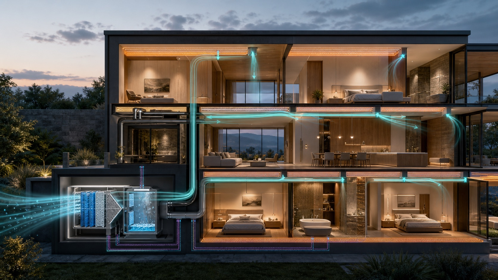

1. **定义目标**：确认温湿度、新风、洁净、噪声和分空间使用目标
2. **建立空气主线**：组织室外空气、过滤、新风除湿、送风、回排风与压差
3. **控制潜热与露点**：将湿负荷从显热处理中解耦
4. **匹配冷热末端**：根据建筑、层高、装修和使用习惯选择末端组合
5. **分空间运行**：卧室、公共区、厨房与卫生间按负荷和压力关系分别控制

---

# 舒适科学

## 人体热平衡

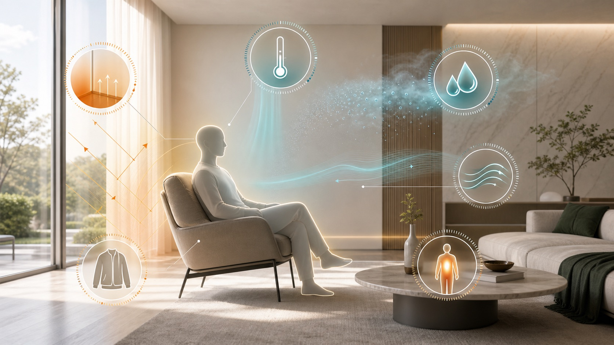

空气温度、平均辐射温度、湿度、气流速度、着衣量和代谢率共同决定体感。空调显示温度达标，不等于舒适已经成立。

## 露点安全

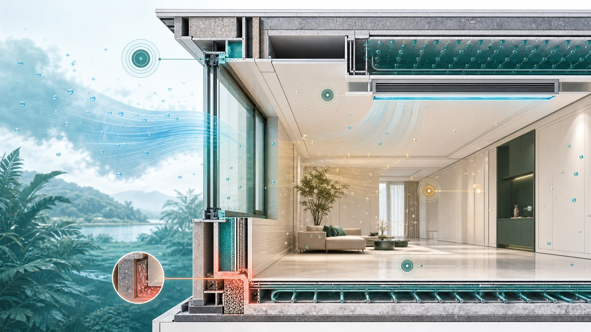

当空气或表面温度接近露点，冷表面、风口和围护结构的结露风险上升。高湿地区必须同时管理温度与空气中的水汽。

## 参考框架

- **ASHRAE 55 / ISO 7730**：人体热舒适与 PMV / PPD 评价框架
- **ASHRAE 62.2 / GB/T 18883**：住宅通风与室内空气质量
- **WHO / WELL / EN 16798-1**：潮湿霉菌、空气、声环境与综合室内环境

> “五恒”不是上述标准的原文术语，而是住宅室内环境目标在中文语境中的综合表达。标准用于建立设计边界和验证方法，不替代具体项目计算。

---

# 室内环境的专业参数

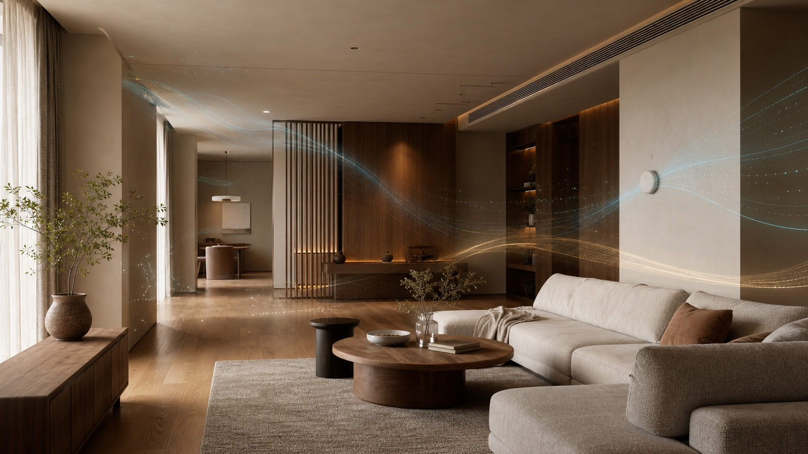

| 参数 | 住宅参考区间或限值 | 人体感受与工程判断 |
| --- | --- | --- |
| 温度 | 夏季 22–28°C；冬季 16–24°C | 还应结合表面温度、垂直温差和平均辐射温度判断，面板温度正常不等于全身舒适 |
| 相对湿度 | 国标夏季 40–80%、冬季 30–60%；住宅建议 40–60% RH | 过高容易黏闷，过低可能引起口鼻、眼睛与皮肤干燥；住宅建议带用于运行沟通，并非另一条强制标准 |
| 露点温度 | 建议运行带 12–16°Cdp；约 16.8°Cdp 为 ASHRAE 舒适区上部湿度边界参考 | 露点反映空气实际携带的水汽，直接连接结露风险；GB/T 18883-2022 未单列住宅露点限值，冷表面温度应高于室内露点并保留安全余量 |
| 风速 | 夏季 ≤0.3m/s；冬季 ≤0.2m/s | 过高会形成吹风感和局部冷感；过低也要结合换气有效性判断 |
| CO₂ | ≤1000ppm（1 小时平均） | 持续接近或超过限值，通常提示人数、新风量或空气组织需要复核；它是通风指标，不等于全部空气品质 |
| PM2.5 | ≤50μg/m³（24 小时平均） | 颗粒物越高，长期健康风险越大；还应关注过滤前后趋势与室外浓度 |
| TVOC | ≤0.60mg/m³（8 小时平均） | 可能伴随眼鼻喉刺激、头痛、恶心、疲劳或眩晕；不同化合物毒性差异很大，TVOC 总量不能单独证明安全 |
| 氡 | ≤300Bq/m³（年平均） | 无色无味，不能靠体感发现，应通过长期检测判断；WHO 建议在可行时以 100Bq/m³ 为目标 |
| 噪声 | 卧室夜间连续声建议 <30dB(A) | 风口、风管、设备与建筑背景声要一起验证，夜间峰值噪声同样影响睡眠 |

> 温湿度、风速、新风量、CO₂、PM2.5、TVOC 与氡的中国限值主要依据 GB/T 18883-2022。不同指标的统计时长不同，不能拿一个瞬时读数直接判定整套住宅是否达标。

---

# 真正的五恒，发生在连续交付里

设备采购只是其中一环。住宅围护结构、湿负荷、风量平衡、管线路由、噪声控制、控制逻辑和现场调试，必须由同一组环境目标贯穿。

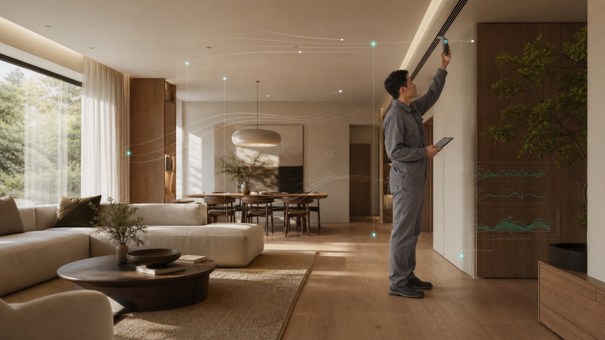

1. **项目诊断**：识别户型、围护结构、人员场景、湿负荷和空气风险
2. **系统设计**：确定新风量、除湿能力、冷热末端、分区和压差关系
3. **机电深化**：协调层高、管线、检修、风口、机房与室内设计边界
4. **施工配合**：核验保温气密、冷凝水、消声与设备安装条件
5. **调试验证**：测量风量、温湿度、CO₂、噪声、压差和控制逻辑
6. **长期维护**：形成滤网、排水、传感器和设备维护计划

## 长期运行边界

五恒首先解决环境稳定性，不等于在所有住宅、所有设定下都天然节能。围护结构、目标温湿度、家庭人数、室外气候与运行策略共同决定实际能耗。长期运行需要持续关注过滤系统、冷凝水与排水、换热器洁净、传感器可信度和跨季控制策略。

---

# 从全国成熟应用，到湖南本地持续落地

五恒系统已经在全国多座城市、不同住宅形态中形成长期应用。泽丰将成熟的系统经验带入长沙、衡阳及湖南其他地区，让高湿气候下的住宅环境拥有更完整的本地设计与交付能力。

## 全国多城 · 大平层与改善型住宅

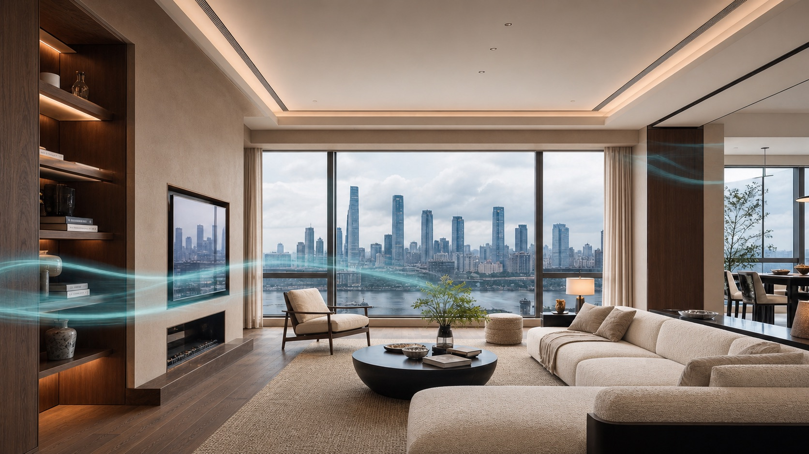

南京、上海、杭州、宁波、合肥等城市的住宅应用，为不同围护结构、空间尺度和家庭使用方式积累了持续经验。

## 全国低密住宅 · 别墅、合院与多层住宅

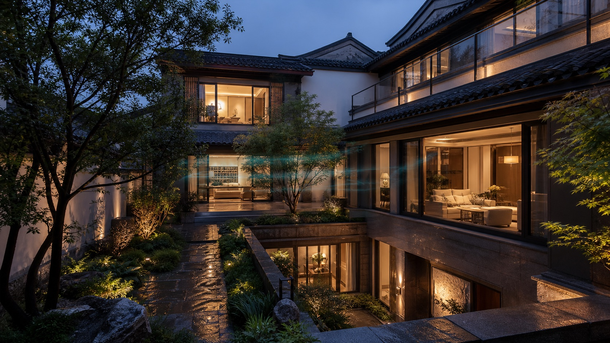

多楼层、地下空间、挑空客厅与庭院边界，需要分层分区、空气组织、排风关系和维护条件共同成立。

## 湖南本地 · 长沙、衡阳与更多城市

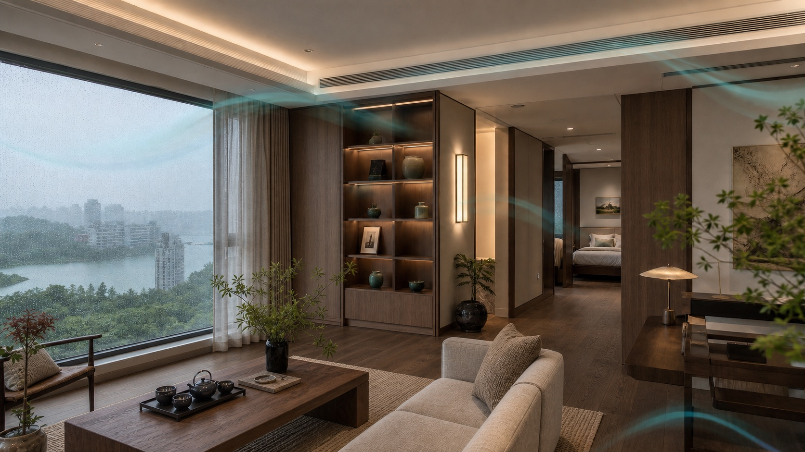

围绕梅雨高湿、过渡季回潮、冬季湿冷和长期关窗空气品质，形成更符合湖南住宅的设计与交付重点。

## 案例应该是一份可追踪记录

真正有说服力的案例不止是一张住宅照片。每个经授权公开的项目，应逐步补充城市与住宅类型、面积与常住人数、系统路线、温湿度和露点趋势、CO₂ 与风量、声环境以及跨季运行记录。缺乏依据的数字不作为宣传承诺。

---

# 我们用运行结果证明系统

| 验证项目 | 形成记录 |
| --- | --- |
| 温湿度与露点 | 连续趋势记录 |
| CO₂ 与新风量 | 卧室空气验证 |
| 声环境检测 | 末端与背景噪声 |
| 风量与压差 | 房间平衡记录 |
| 跨季运行复核 | 梅雨、高湿与冬季 |

每套项目在交付阶段形成温湿度、露点、风量、空气品质与声环境记录，让系统表现能够被持续查看、复核与优化。

---

# 什么样的住宅，更值得优先做五恒评估

- 长沙、衡阳及湖南等高湿地区住宅
- 大平层、别墅、合院与多层住宅
- 长期关闭门窗、重视安静和空间完整度
- 家中有儿童、老人或长期居家人员
- 重视睡眠、空气品质和低风感
- 处于建筑设计、机电深化或装修前期

面积不是唯一条件。小面积住宅同样可以评估，但应先判断问题是否需要完整五恒路线，避免为了概念而堆叠系统。

---

# 让住宅，拥有自己的气候

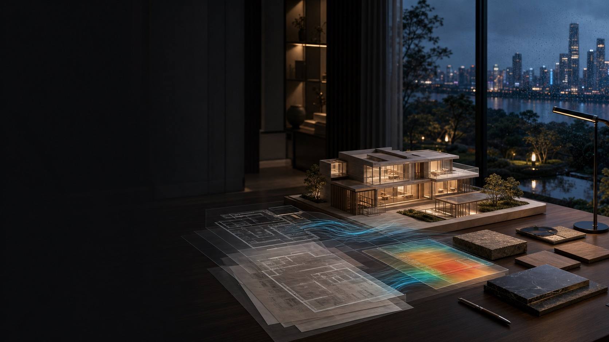

温度、湿度、空气、洁净与安静，不再由彼此分离的设备决定，而是在同一套住宅环境中持续协同。

**温和 · 干爽 · 新鲜 · 洁净 · 安静**

---

## 泽丰机电 ZEFENG MEP

**高端住宅机电系统服务**

五恒住宅 · 全空气系统 · 辐射系统 · 生活热水 · 水处理 · 智能控制

官网：[www.zfmep.com](https://www.zfmep.com)
